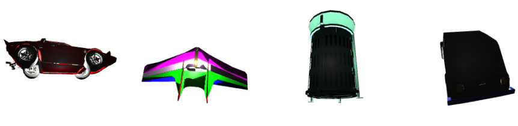
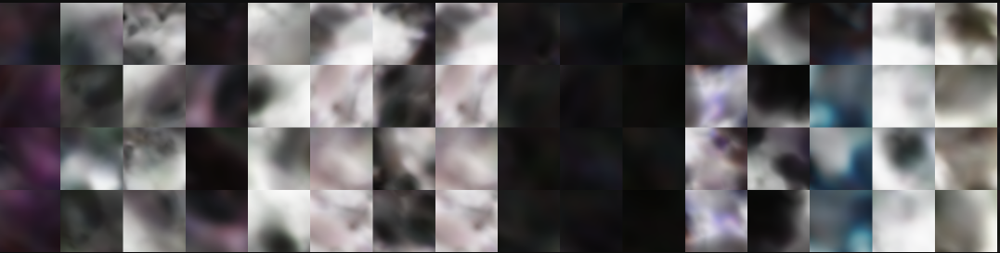

# Supersizing 3D Reconstruction Project

In this work, I attempt to replicate the methods in the paper **"Pre-train, Self-train, Distill: A Simple Recipe for Supersizing 3D Reconstruction"** by Kalyan Alwala et al., originally published by Facebook Research.

The goal was to replicate the 3D supersizing pipeline using smaller, custom datasets and a modified rendering pipeline.

## Overview

The original paper proposed a method for supervising 3D reconstruction using:

1. **Supervised Pre-Training**: Training on synthetic textured 3D models
2. **Self-Training**: Utilizing multi-hypothesis cameras and self-supervised learning
3. **Distillation**: Aggregating these category-specific models into a unified network

This project modifies the approach by utilizing different datasets and implementing custom pipelines while adhering to the principles of the original method.

## Implementation Details

I rewrote the Dataset and Dataloader classes and adapted the code and model to my custom Dataset and pipeline.

[Go Straight to Results](#results)

Additionally:

### Pre-Training

- **Dataset**: I used synthetic 3D models from ShapeNet for four categories:

  - Airplane (`02691156`)
  - Trash Bin (`02747177`)
  - Car (`02958343`)
  - Laptop (`03642806`)
  - Each category included 200 models.
- **Custom Renderer**:

  - I implemented a custom renderer for ShapeNet's 3D textured models using the `pyrender` Python library.
  - For each model, I rendered five unique views by randomly sampling azimuth angles from `[0, 360]` and elevation angles from `[-75, 75]

  

  

  - I generated RGB images, segmentation masks, and camera projection parameters for each view.
  - To handle the large output files efficiently, I serialized all the data into the **HDF5 format**.

    

    

  

  
  
  
  
  
  

  

  

### Self-Training

- **Datasets**:

  - I worked with the **CUB-200-2011** dataset (birds) and created a custom airplane dataset by using ShapeNet's rendered models. Each dataset had 200 images.

  
  
  
  
  
  

<!-- Empty divs to maintain the 3x3 grid layout -->

  

  

- **Processing**:

  - I implemented an OpenCV pipeline to generate bounding boxes for each image.
  - I split the data into training and validation sets as described in the original paper.

### Distillation

- I aggregated features from the pre-trained synthetic model and category-specific models into a unified network following the distillation process in the paper.
- I ran into challenges replicating the distillation outputs due to differences in my pre-training pipeline and dataset setup.

  

  
  
  

<!-- Empty divs to maintain the 3x3 grid layout -->

  

  

## Results

Below, I present results from training the model with my custom pipeline on High Performance Computing (HPC) GPUs at Friedrich-Alexander University Erlangen-Nuremberg.

  
  
  

### Conclusion

The results highlighted the significant impact of dataset and pipeline variations on the replication process. Differences in rendering pipelines and datasets posed substantial challenges to achieving fidelity with the original work.

## Acknowledgments

I completed this project under the guidance of <a href="https://eggerbernhard.ch/" style="color: blue; text-decoration: none;">**Prof. Dr. Bernhard Egger**</a> and <a href="https://mweiherer.github.io/" style="color: blue; text-decoration: none;">**Maximilian Weiherer**</a>.

## References

- Kalyan Alwala, Abhinav Gupta, and Shubham Tulsiani, *"Pre-train, Self-train, Distill: A Simple Recipe for Supersizing 3D Reconstruction"*. CVPR 2022.
- Additional datasets and resources:
  - ShapeNet
  - CUB-200-2011

For further details, request for my full project report.
